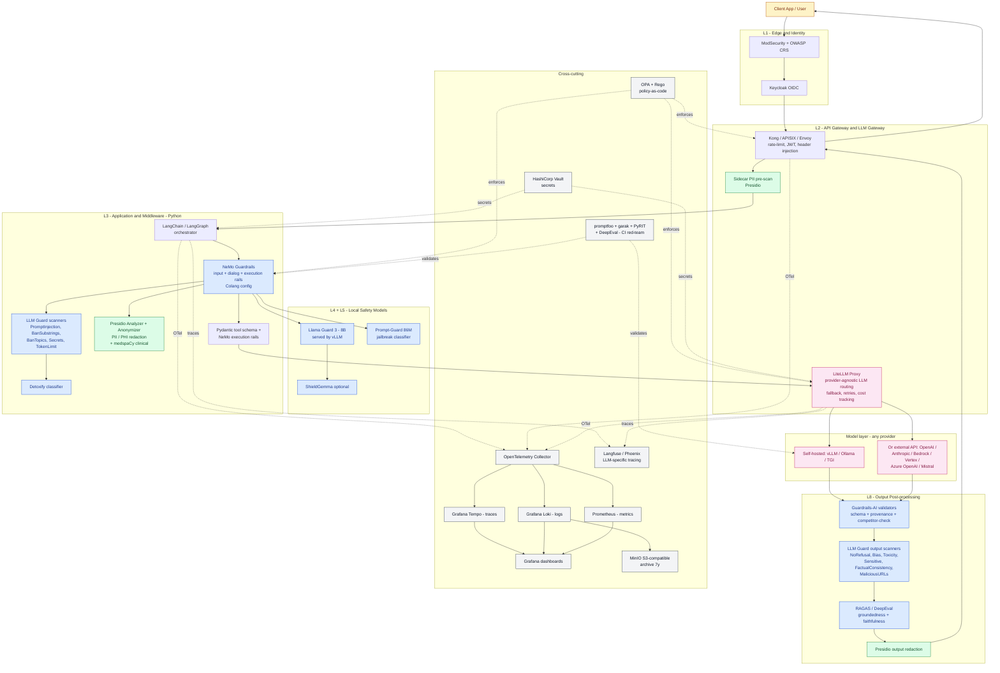
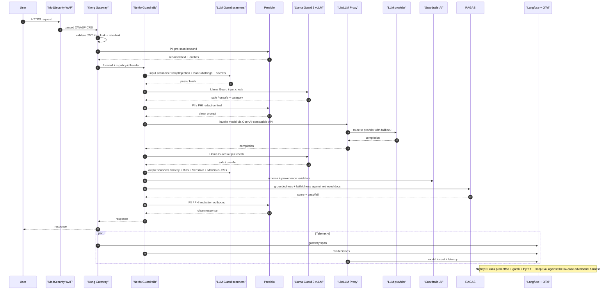

# Guardrails - Cloud-Agnostic Open Source Stack

> **Companion to:** `guardrails-sdks-and-architecture.md` (Azure-specific version)
> **Purpose:** Provide an **open-source, cloud-portable** guardrail solution that runs identically on AWS, GCP, Azure, on-prem Kubernetes, or a laptop. No managed AI safety services required.
> **Stack:** Python 3.11 + LangChain/LangGraph + Open-Source guardrail libraries + self-hosted models (or any LLM provider)

---

## 1. Approach

The same **8-layer defense-in-depth** model from the Azure plan is preserved, but every Azure-managed service is replaced with an **open-source equivalent** that you self-host (in containers / Kubernetes) or call as a library. Nothing in this stack is tied to a single cloud provider.

Design principles:

1. **Library-first, service-second.** Prefer in-process Python libraries (Presidio, Guardrails-AI, LLM-Guard) over network calls. Faster, cheaper, no extra infra.
2. **Standard interfaces only.** S3-compatible object store, OTLP for traces, OpenAI-compatible HTTP for model calls. Swap the backend without changing code.
3. **Kubernetes-native deployment.** Helm charts + Terraform; the same manifests run on EKS, AKS, GKE, OpenShift, or kind.
4. **Bring-your-own-model.** Works with self-hosted (vLLM, Ollama, TGI) or any hosted API (OpenAI, Anthropic, Bedrock, Vertex, Azure OpenAI). The guardrails do not care.
5. **Policy-as-code with OPA/Rego.** Replaces Azure Policy with a portable policy engine.

---

## 2. Azure-service -> Open-source replacement matrix

| Concern | Azure (previous plan) | Cloud-agnostic open source replacement | License |
|---------|------------------------|------------------------------------------|---------|
| Harmful content classification | Azure AI Content Safety | **Llama Guard 3** (Meta) via vLLM/Ollama, or **ShieldGemma** (Google), or **Detoxify** | Llama 3 / Apache-2.0 / MIT |
| Prompt injection / jailbreak detection | Prompt Shields | **Prompt-Guard-86M** (Meta) + **Rebuff** + **LLM Guard** `PromptInjection` scanner | Llama 3 / Apache-2.0 / MIT |
| PII detection & redaction | Azure AI Language PII | **Microsoft Presidio** (`presidio-analyzer`, `presidio-anonymizer`) | MIT |
| **PHI detection (HIPAA)** | Azure AI Language `domain=phi` | **Presidio + medspaCy / scispaCy** clinical recognizers; **Stanza biomedical**; **Philter** (UCSF) | MIT / Apache-2.0 |
| Custom blocklists / regulated phrases | Content Safety Blocklists | **LLM Guard** `BanSubstrings` / `BanTopics` + YAML policy file | MIT |
| Groundedness / hallucination | Content Safety Groundedness | **RAGAS** (`faithfulness`, `answer_relevancy`), **DeepEval** `HallucinationMetric`, **TruLens** `groundedness` | Apache-2.0 / MIT |
| Protected material / copyright | Content Safety Protected Material | **LLM Guard** `Code` scanner + n-gram match against a known-text corpus | MIT |
| Toxicity / bias | RAI categories | **Detoxify**, **Perspective-style** classifiers, **HAP detector (IBM)** | MIT / Apache-2.0 |
| Output schema / format enforcement | (custom) | **Guardrails-AI** (`guardrails-ai`), **Outlines**, **Instructor**, **NeMo Guardrails** Colang flows | Apache-2.0 / MIT |
| Tool / function-call validation | (custom) | **Pydantic** schemas + **NeMo Guardrails** dialog rails | MIT / Apache-2.0 |
| Agent-level safety profile | Foundry Agent RAI | **NVIDIA NeMo Guardrails** (Colang config per agent) | Apache-2.0 |
| Model deployment "RAI policy" | AOAI RAI policies | **NeMo Guardrails** config + **Llama Guard** policy taxonomy file | Apache-2.0 |
| **API gateway** (rate limit, auth, header injection) | Azure APIM | **Kong**, **APISIX**, **Traefik**, or **Envoy** | Apache-2.0 |
| **LLM gateway / routing / fallback / cost** | (none) | **LiteLLM Proxy** or **Portkey AI Gateway** (OSS) | MIT / Apache-2.0 |
| WAF / network | Front Door + WAF | **ModSecurity + OWASP CRS** in front of NGINX/Traefik; **Cloudflare** if hosted | Apache-2.0 |
| Identity / OIDC | Entra ID | **Keycloak** | Apache-2.0 |
| Secrets management | Key Vault | **HashiCorp Vault** (OSS) or **Infisical** | MPL-2.0 / MIT |
| Policy-as-code | Azure Policy | **Open Policy Agent (OPA) + Rego**, **Kyverno** for K8s | Apache-2.0 |
| Observability / tracing | App Insights + Log Analytics | **OpenTelemetry Collector** -> **Grafana Tempo** (traces) + **Loki** (logs) + **Prometheus** (metrics) + **Grafana** | Apache-2.0 / AGPL |
| LLM-specific observability | Foundry tracing | **Langfuse**, **Phoenix (Arize)**, **OpenLLMetry** | MIT / Apache-2.0 / Elastic |
| Object storage / archive | ADLS Gen2 | **MinIO** (S3-compatible), runs anywhere | AGPL-3.0 / Commercial |
| Eval harness / red-team | `azure-ai-evaluation` | **DeepEval**, **promptfoo**, **Giskard**, **garak** (NVIDIA red-team), **PyRIT** (Microsoft, OSS) | Apache-2.0 / MIT |
| Data catalog / lineage | Microsoft Purview | **OpenMetadata**, **DataHub** | Apache-2.0 |
| Self-hosted model serving | Foundry / AOAI | **vLLM**, **Ollama**, **TGI** (HuggingFace), **llama.cpp** | Apache-2.0 / MIT |
| Container orchestration | Container Apps | **Kubernetes** (EKS / GKE / AKS / OpenShift / k3s / kind) | Apache-2.0 |
| IaC | Bicep | **Terraform** + **Helm** + **Kustomize** | MPL-2.0 / Apache-2.0 |

---

## 3. Open-source guardrail library cheat sheet

These three frameworks cover ~90% of the guardrail logic; pick one as primary and use the others to fill gaps.

### 3.1 NeMo Guardrails (NVIDIA) - **primary orchestrator**

- **Package:** `nemoguardrails`
- **Strengths:** Colang DSL for input/output/dialog/retrieval/execution rails; native integration with LangChain; pluggable jailbreak detection; Llama Guard support out of the box.
- **Use for:** L3 middleware, L4 agent safety profile, dialog flow control, tool gating.

### 3.2 LLM Guard (Protect AI) - **scanner library**

- **Package:** `llm-guard`
- **Strengths:** 20+ ready-made input scanners (Anonymize, BanSubstrings, BanTopics, PromptInjection, TokenLimit, Secrets) and output scanners (NoRefusal, Bias, Toxicity, Sensitive, Relevance, FactualConsistency, MaliciousURLs).
- **Use for:** L3 input/output scanning, PII pre-scan in API gateway sidecar, regulated-phrase blocklists.

### 3.3 Guardrails-AI - **schema and validator hub**

- **Package:** `guardrails-ai` + validators from Guardrails Hub
- **Strengths:** Pydantic-style validators, structured-output enforcement, large hub of community validators (`detect-pii`, `competitor-check`, `toxic-language`, `provenance`, `nsfw-text`).
- **Use for:** L8 output validation, structured-output enforcement, tool-call schema.

### 3.4 Specialized libraries

| Need | Library |
|------|---------|
| PII / PHI redaction | **Presidio** (`presidio-analyzer`, `presidio-anonymizer`) + **medspaCy** for clinical |
| Toxicity classifier | **Detoxify** (`detoxify`) |
| Hallucination / groundedness | **RAGAS** (`ragas`), **DeepEval** (`deepeval`), **TruLens** (`trulens-eval`) |
| Jailbreak / red-team | **garak** (`garak`), **PyRIT** (`pyrit`), **Rebuff** (`rebuff`) |
| Eval / regression | **promptfoo**, **DeepEval**, **Giskard** |
| Local safety models | **Llama Guard 3 (8B / 1B)**, **Prompt-Guard-86M**, **ShieldGemma 2B/9B**, served via vLLM |

---

## 4. SDK / Package matrix per guardrail (cloud-agnostic)

| # | Guardrail | Library | PyPI / image | Layer |
|---|-----------|---------|--------------|-------|
| 1 | Harmful content (input + output) | Llama Guard 3 via vLLM | `vllm` + HF model `meta-llama/Llama-Guard-3-8B`; called through `nemoguardrails` or `llm-guard` `Toxicity` | L3, L8 |
| 2 | Toxicity classifier (lightweight, CPU) | Detoxify | `detoxify` | L3, L8 |
| 3 | Prompt injection / jailbreak | Prompt-Guard + Rebuff + LLM Guard | `llm-guard` (`PromptInjection`), `rebuff`, HF `meta-llama/Prompt-Guard-86M` | L3 |
| 4 | Indirect prompt injection (RAG) | NeMo Guardrails retrieval rails + LLM Guard | `nemoguardrails`, `llm-guard` | L3 |
| 5 | PII detection & redaction | Presidio | `presidio-analyzer`, `presidio-anonymizer` | L2, L3, L8 |
| 6 | **PHI detection (HIPAA)** | Presidio + medspaCy clinical recognizers | `presidio-analyzer`, `medspacy`, `scispacy` + UMLS models | L2, L3, L8 |
| 7 | Custom blocklists | LLM Guard `BanSubstrings` / `BanTopics` | `llm-guard` (YAML config) | L7 |
| 8 | Protected material / copyright | LLM Guard `Code` + n-gram match | `llm-guard`, `datasketch` (MinHash) | L8 |
| 9 | Groundedness / hallucination | RAGAS / DeepEval / TruLens | `ragas`, `deepeval`, `trulens-eval` | L8 |
| 10 | Output schema validation | Guardrails-AI / Outlines / Instructor | `guardrails-ai`, `outlines`, `instructor` | L8 |
| 11 | Agent-level safety profile | NeMo Guardrails Colang config | `nemoguardrails` | L4 |
| 12 | "RAI policy" equivalent | NeMo Guardrails YAML + Llama Guard taxonomy | `nemoguardrails` | L5 |
| 13 | Tool / function-call validation | Pydantic + NeMo execution rails | `pydantic`, `nemoguardrails` | L3 |
| 14 | Orchestration | LangChain / LangGraph | `langchain`, `langgraph` | L3 |
| 15 | API gateway | Kong / APISIX / Envoy | Helm charts | L2 |
| 16 | LLM gateway (provider-agnostic) | LiteLLM Proxy | `litellm[proxy]` | L2/L3 |
| 17 | WAF | ModSecurity + OWASP CRS | container | L1 |
| 18 | Identity (OIDC) | Keycloak | Helm chart | L1 |
| 19 | Secrets | HashiCorp Vault | Helm chart, `hvac` Python client | Cross-cutting |
| 20 | Policy-as-code | OPA + Rego | `open-policy-agent`, `opa` CLI | Cross-cutting |
| 21 | Observability (traces/metrics/logs) | OpenTelemetry + Tempo + Loki + Prometheus + Grafana | `opentelemetry-sdk`, OTel Collector | Cross-cutting |
| 22 | LLM observability | Langfuse / Phoenix | `langfuse`, `arize-phoenix` | Cross-cutting |
| 23 | Object storage | MinIO (S3 API) | `boto3` | Cross-cutting |
| 24 | Red-team / adversarial eval | garak + PyRIT + promptfoo | `garak`, `pyrit`, `promptfoo` | CI |
| 25 | Self-hosted model | vLLM / Ollama / TGI | `vllm`, `ollama`, `text-generation-inference` | Model layer |

### `requirements.txt` (cloud-agnostic agent service)

```text
# --- Orchestration ---
langchain>=0.3.0
langgraph>=0.2.0

# --- Guardrail frameworks ---
nemoguardrails>=0.10.0
llm-guard>=0.3.15
guardrails-ai>=0.5.0

# --- PII / PHI ---
presidio-analyzer>=2.2.355
presidio-anonymizer>=2.2.355
medspacy>=1.1.0
scispacy>=0.5.4

# --- Specialized classifiers ---
detoxify>=0.5.2
rebuff>=0.1.1

# --- Hallucination / groundedness ---
ragas>=0.2.0
deepeval>=2.0.0
trulens-eval>=1.0.0

# --- Schema / structured output ---
pydantic>=2.7.0
outlines>=0.1.0
instructor>=1.5.0

# --- LLM gateway (provider-agnostic) ---
litellm>=1.50.0

# --- Observability ---
opentelemetry-sdk>=1.27.0
opentelemetry-exporter-otlp>=1.27.0
langfuse>=2.50.0

# --- Secrets / storage ---
hvac>=2.3.0          # HashiCorp Vault
boto3>=1.35.0        # MinIO (S3-compatible)

# --- Eval / red-team (CI only) ---
promptfoo            # JS, install via npm; reference here for completeness
garak>=0.9.0
pyrit>=0.5.0
```

---

## 5. Architecture diagram (Mermaid) - cloud-agnostic




---

## 6. Sequence: a single request through the OSS guardrail stack




---

## 7. Quick reference - "which OSS library do I import for ___?"

- **Block hate / sexual / violence / self-harm** -> Llama Guard 3 via `nemoguardrails` rail, or `detoxify` for CPU-only
- **Detect prompt injection / jailbreak** -> `from llm_guard.input_scanners import PromptInjection`; or `rebuff`; or Prompt-Guard-86M
- **Strip PII before the prompt** -> `from presidio_analyzer import AnalyzerEngine`; `from presidio_anonymizer import AnonymizerEngine`
- **Strip PHI (HIPAA)** -> Presidio + `medspacy` clinical pipeline + `scispacy` UMLS linker
- **Custom blocklists** -> `from llm_guard.input_scanners import BanSubstrings, BanTopics`
- **Hallucination / groundedness** -> `from ragas.metrics import faithfulness, answer_relevancy`; or `deepeval` `HallucinationMetric`
- **Structured output enforcement** -> `import guardrails as gd` or `outlines` or `instructor`
- **Agent-level safety profile** -> `nemoguardrails` Colang config (`config.yml` + `*.co` flows)
- **Provider-agnostic LLM call** -> `from litellm import completion` (works with OpenAI / Anthropic / Bedrock / Vertex / Ollama / vLLM)
- **API gateway (rate limit, JWT)** -> Kong / APISIX Helm chart
- **Identity** -> Keycloak (OIDC)
- **Secrets** -> `import hvac` (HashiCorp Vault)
- **Policy-as-code** -> OPA + Rego, evaluated by Kong plugin or sidecar
- **Tracing** -> `opentelemetry-sdk` -> OTLP -> Tempo + Loki + Prometheus + Grafana; LLM-specific in **Langfuse** or **Phoenix**
- **Object storage / archive** -> MinIO via `boto3`
- **Red-team / eval** -> `garak`, `pyrit`, `promptfoo`, `deepeval`

---

## 8. Deployment topology (any cloud / on-prem)

```text
Kubernetes cluster (EKS | GKE | AKS | OpenShift | k3s | kind)
+- ingress-nginx + ModSecurity + OWASP CRS
+- Kong / APISIX (API gateway)
+- Keycloak (OIDC)
+- HashiCorp Vault
+- LiteLLM Proxy (Deployment + HPA)
+- Agent service (Deployment + HPA)
|     |- LangChain + NeMo Guardrails + LLM Guard + Presidio
+- vLLM serving Llama Guard 3 + Prompt-Guard (GPU node pool)
+- vLLM serving primary LLM (optional - or use external API via LiteLLM)
+- OpenTelemetry Collector (DaemonSet)
+- Tempo + Loki + Prometheus + Grafana (observability stack)
+- Langfuse (StatefulSet + Postgres)
+- MinIO (StatefulSet, S3-compatible) for archives
+- OPA (sidecar to Kong) + OPA Gatekeeper (cluster admission)

IaC: Terraform (cluster + cloud resources) + Helm (workloads) + Kustomize (env overlays)
CI: GitHub Actions / GitLab CI / Jenkins - runs promptfoo + garak + PyRIT + DeepEval against the 64-case harness
```

This topology runs identically on AWS, GCP, Azure, Oracle Cloud, IBM Cloud, OpenStack, bare metal, or a developer laptop (kind + Ollama).

---

## 9. Decision summary - cloud-agnostic risk -> library

| Risk | Primary OSS library | Fallback / Defense-in-depth |
|------|----------------------|------------------------------|
| Harmful content | **Llama Guard 3** via vLLM | `detoxify` (CPU) + NeMo output rail |
| **PII** | **Presidio** | LLM Guard `Anonymize` scanner + APIM regex pre-scan |
| **PHI** | **Presidio + medspaCy** clinical recognizers | Philter (UCSF) + custom UMLS recognizer |
| Prompt injection | **Prompt-Guard-86M + LLM Guard `PromptInjection`** | Rebuff + NeMo input rail + system prompt hardening |
| Hallucination | **RAGAS faithfulness** | DeepEval `HallucinationMetric` + TruLens groundedness |
| Copyright leakage | LLM Guard `Code` + MinHash n-gram match | Custom corpus check |
| Regulated phrases | LLM Guard `BanSubstrings` / `BanTopics` | OPA Rego rules |
| Tool abuse | Pydantic schema + NeMo execution rails | OPA tool-allow-list policy |
| Compliance drift | OPA + Kyverno | Terraform plan diff in CI |
| Eval / red-team | promptfoo + garak + PyRIT + DeepEval | Manual review |

---

## 10. Migration notes from the Azure plan

- The 8-layer model, threat profiles (`strict-production` / `moderate-internal` / `permissive-research`), 64-case adversarial harness, and ADO work-item structure are unchanged.
- Replace `azure-ai-contentsafety.analyze_text` with NeMo rail -> Llama Guard.
- Replace `azure-ai-textanalytics.recognize_pii_entities` with Presidio (`+ medspaCy` for `domain="phi"`).
- Replace `azure-mgmt-cognitiveservices.rai_policies` with NeMo `config.yml` versioned in git.
- Replace APIM policy XML with Kong/APISIX plugins or Envoy filters (declarative YAML).
- Replace Azure Policy with OPA Rego + Kyverno.
- Replace Log Analytics + App Insights with OTel + Tempo + Loki + Prometheus + Grafana + Langfuse.
- Replace Foundry evaluators with promptfoo + garak + PyRIT + DeepEval in CI.

The Python application code changes are localized to two files: the middleware module (swap `AzureContentModerationMiddleware` for `nemoguardrails.RunnableRails`) and the model client (swap the Azure OpenAI client for `litellm`). Everything else in the agent service stays the same.

