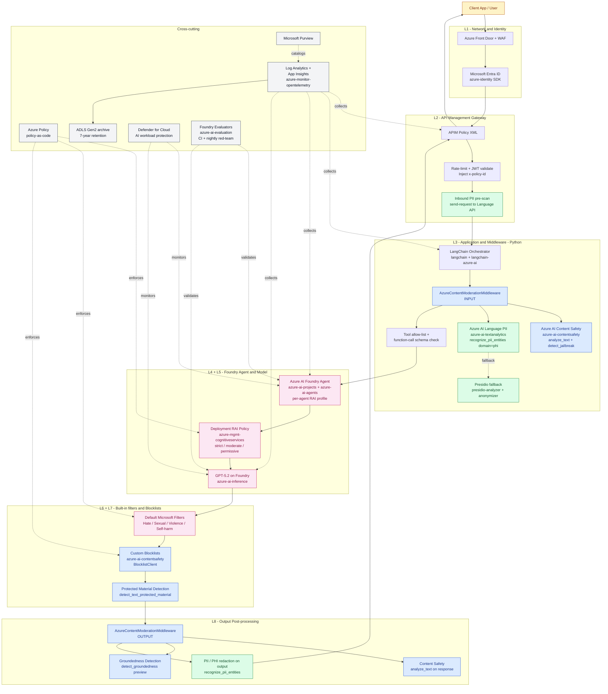
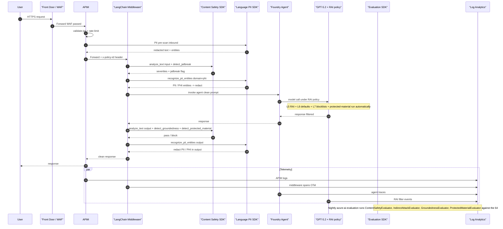

# Guardrails - SDKs, Packages, and Architecture

> **Companion to:** `guardrails-implementation-plan.md`, `guardrails-code-implementation.md`
> **Purpose:** Identify the exact Azure service, SDK, and package used for each guardrail layer (Content Safety, PII, PHI, Jailbreak, Groundedness, etc.) and show the end-to-end approach with a Mermaid architecture diagram.
> **Stack:** Python 3.11 + LangChain + Azure AI Foundry + Azure OpenAI + Azure Content Safety + APIM + Azure Policy

---

## 1. Approach

The guardrail stack is **defense-in-depth**: no single SDK enforces everything. Each risk category (harmful content, PII, PHI, prompt injection, hallucination, regulated speech) is handled by the **service that is purpose-built for it**, with overlap so that a bypass at one layer is caught at the next.

Three principles drive the SDK selection:

1. **Prefer managed Azure services over custom code.** Use Azure AI Content Safety, Azure AI Language, and Foundry-native RAI policies before reaching for Presidio or regex.
2. **Prefer SDK over REST.** Every layer below has a first-party Python/.NET SDK; we use the SDK for retries, auth (Managed Identity), and telemetry.
3. **Prefer policy-as-code over portal config.** RAI policies, blocklists, content filters, and APIM policies are deployed via Bicep + Azure Policy so they are versioned, reviewed, and drift-detected.

Inbound flow: PII/PHI is **redacted before** the prompt reaches the model. Outbound flow: groundedness, PII, and protected-material checks run **after** the model responds and **before** the response leaves APIM.

---

## 2. SDK / Package matrix per guardrail

| # | Guardrail | Azure Service | Python Package (PyPI) | Key SDK class / API | Layer |
|---|-----------|---------------|------------------------|---------------------|-------|
| 1 | Harmful content (Hate, Sexual, Violence, Self-harm) - **input + output** | Azure AI Content Safety | `azure-ai-contentsafety` | `ContentSafetyClient.analyze_text()` | L3, L8 |
| 2 | Harmful content (image / multimodal) | Azure AI Content Safety | `azure-ai-contentsafety` | `ContentSafetyClient.analyze_image()` | L3, L8 |
| 3 | **Prompt injection / jailbreak (direct)** | Azure AI Content Safety - Prompt Shields | `azure-ai-contentsafety` | `ContentSafetyClient.detect_jailbreak()` (a.k.a. Prompt Shields) | L3 |
| 4 | **Prompt injection (indirect, RAG / tool output)** | Azure AI Content Safety - Prompt Shields | `azure-ai-contentsafety` | Prompt Shields with `documents=[...]` | L3 |
| 5 | **PII detection & redaction** (names, SSN, account#, card#, email, phone, address) | Azure AI Language - PII | `azure-ai-textanalytics` | `TextAnalyticsClient.recognize_pii_entities(domain="phi" \| None)` | L2, L3, L8 |
| 6 | **PHI detection & redaction** (HIPAA categories: medical record #, health plan ID, diagnoses, conditions) | Azure AI Language - PII with `domain="phi"` | `azure-ai-textanalytics` | `recognize_pii_entities(domain=PiiEntityDomain.PHI)` | L2, L3, L8 |
| 7 | PII fallback / on-prem / structured patterns (account masks, internal IDs) | Microsoft Presidio (open source) | `presidio-analyzer`, `presidio-anonymizer` | `AnalyzerEngine`, `AnonymizerEngine` with custom `PatternRecognizer` | L2, L3 |
| 8 | **Custom blocklists** (financial regulated phrases, codenames, competitor names) | Azure AI Content Safety - Blocklists | `azure-ai-contentsafety` | `BlocklistClient.create_or_update_text_blocklist()`, `add_or_update_blocklist_items()` | L7 |
| 9 | **Protected material detection** (copyrighted text / code) | Azure AI Content Safety | `azure-ai-contentsafety` | `ContentSafetyClient.detect_text_protected_material()` | L5, L8 |
| 10 | **Groundedness / hallucination check** | Azure AI Content Safety - Groundedness Detection | `azure-ai-contentsafety` | `ContentSafetyClient.detect_groundedness()` (preview) | L8 |
| 11 | **Model-level RAI policy** (severity thresholds bound to deployment) | Azure AI Foundry / Azure OpenAI RAI Policies | `azure-mgmt-cognitiveservices` | `CognitiveServicesManagementClient.rai_policies.create_or_update()` | L5 |
| 12 | **Agent-level safety profile** (per-agent stricter overrides) | Azure AI Foundry Agent Service | `azure-ai-projects`, `azure-ai-agents` | `AIProjectClient.agents.create_agent(content_safety=...)` | L4 |
| 13 | **Foundry safety evaluators** (offline + CI eval of prompts/responses) | Azure AI Evaluation SDK | `azure-ai-evaluation` | `ContentSafetyEvaluator`, `GroundednessEvaluator`, `IndirectAttackEvaluator`, `ProtectedMaterialEvaluator` | L8, CI |
| 14 | LangChain orchestration + middleware integration | LangChain | `langchain`, `langchain-openai`, `langchain-azure-ai` | `AzureContentModerationMiddleware`, `AzureAIChatCompletionsModel` | L3 |
| 15 | **APIM gateway policies** (rate limit, JWT, header injection, inbound PII pre-scan) | Azure API Management | `azure-mgmt-apimanagement` (deploy) + APIM policy XML (runtime) | `<validate-jwt>`, `<rate-limit-by-key>`, `<set-header name="x-policy-id">`, `<send-request>` to Content Safety | L2 |
| 16 | **Network / WAF** | Azure Front Door + WAF + Private Link | `azure-mgmt-frontdoor`, `azure-mgmt-network` | OWASP managed rule set, custom rules | L1 |
| 17 | **Identity / authZ** | Microsoft Entra ID + Managed Identity | `azure-identity` | `DefaultAzureCredential`, `ManagedIdentityCredential` | L1 |
| 18 | **Policy-as-code / compliance** | Azure Policy | `azure-mgmt-resource`, Bicep | Custom policy definitions (`raiPolicy must be one of strict-production / moderate-internal / permissive-research`) | Cross-cutting |
| 19 | **Audit / observability** | Log Analytics + Application Insights | `azure-monitor-opentelemetry`, `opencensus-ext-azure` | `configure_azure_monitor()`; OTel traces with `x-policy-id`, `request-id` | Cross-cutting |
| 20 | **Long-term audit archive** (7y financial services) | ADLS Gen2 + Continuous Export | `azure-storage-file-datalake` | Diagnostic Setting -> Storage | Cross-cutting |
| 21 | **Data governance / lineage** | Microsoft Purview | `azure-purview-catalog` | Asset registration for prompts/responses | Cross-cutting |
| 22 | **Threat protection on AI workload** | Microsoft Defender for Cloud - AI workload | (portal / ARM) | AI Threat Protection alerts | Cross-cutting |

### `requirements.txt` (Python agent service)

```text
# --- Core orchestration ---
langchain>=0.3.0
langchain-openai>=0.2.0
langchain-azure-ai>=0.1.2

# --- Azure AI Foundry / Agents ---
azure-ai-projects>=1.0.0
azure-ai-agents>=1.0.0
azure-ai-inference>=1.0.0

# --- Guardrails: Content Safety (harmful content, prompt shields, blocklists, protected material, groundedness) ---
azure-ai-contentsafety>=1.0.0

# --- Guardrails: PII & PHI ---
azure-ai-textanalytics>=5.3.0
presidio-analyzer>=2.2.355
presidio-anonymizer>=2.2.355

# --- Guardrails: Offline evaluation ---
azure-ai-evaluation>=1.0.0

# --- Auth, mgmt, observability ---
azure-identity>=1.17.0
azure-mgmt-cognitiveservices>=13.5.0
azure-monitor-opentelemetry>=1.6.0
opentelemetry-instrumentation-requests>=0.48b0
```

---

## 3. Mapping: Guardrail layer -> SDK call

| Layer | SDK call (Python) | Triggered when |
|-------|-------------------|----------------|
| L1 Network | (infra only - WAF / Front Door) | Every TCP connection |
| L2 APIM | APIM policy XML `<send-request>` -> Content Safety + Language PII | Every inbound HTTP request |
| L3 Middleware - input | `AzureContentModerationMiddleware` -> `ContentSafetyClient.analyze_text` + `detect_jailbreak`; `TextAnalyticsClient.recognize_pii_entities` | Every prompt before model call |
| L4 Agent RAI | `AIProjectClient.agents.create_agent(content_safety=...)` (config-time) | Agent invocation |
| L5 Deployment RAI | `CognitiveServicesManagementClient.rai_policies.create_or_update` (deploy-time) | Every model call |
| L6 Default filters | (managed by Microsoft) | Every model call |
| L7 Blocklists | `BlocklistClient.add_or_update_blocklist_items` (deploy); evaluated automatically by L5 | Every model call |
| L8 Output post-process | `ContentSafetyClient.analyze_text` (output), `detect_groundedness`, `detect_text_protected_material`, `recognize_pii_entities` | Every response before return |
| Eval / CI | `azure-ai-evaluation` `ContentSafetyEvaluator`, `IndirectAttackEvaluator`, `GroundednessEvaluator`, `ProtectedMaterialEvaluator` | CI pipeline + nightly red-team |

---

## 4. Architecture diagram (Mermaid)




---

## 5. Sequence: a single request through every guardrail




---

## 6. Quick reference - "which SDK do I import for ___?"

- **"Block hate / sexual / violence / self-harm"** -> `from azure.ai.contentsafety import ContentSafetyClient` -> `analyze_text`
- **"Detect a prompt injection / jailbreak"** -> `ContentSafetyClient.detect_jailbreak` (Prompt Shields)
- **"Strip PII before the prompt"** -> `from azure.ai.textanalytics import TextAnalyticsClient` -> `recognize_pii_entities()`
- **"Strip PHI (HIPAA) before the prompt"** -> same SDK with `domain=PiiEntityDomain.PHI`
- **"Redact internal account numbers / custom patterns"** -> `from presidio_analyzer import AnalyzerEngine` + custom `PatternRecognizer`
- **"Add a financial-regulated phrase list"** -> `from azure.ai.contentsafety import BlocklistClient` -> `add_or_update_blocklist_items`
- **"Check the model didn't hallucinate"** -> `ContentSafetyClient.detect_groundedness` (preview)
- **"Check for copyrighted text"** -> `ContentSafetyClient.detect_text_protected_material`
- **"Define a strict RAI policy in code"** -> `from azure.mgmt.cognitiveservices import CognitiveServicesManagementClient` -> `rai_policies.create_or_update`
- **"Configure agent-level safety"** -> `from azure.ai.projects import AIProjectClient` -> `agents.create_agent(content_safety=...)`
- **"Run the eval harness in CI"** -> `from azure.ai.evaluation import ContentSafetyEvaluator, IndirectAttackEvaluator, GroundednessEvaluator, ProtectedMaterialEvaluator`
- **"Wire it into LangChain"** -> `from langchain_azure_ai.middleware import AzureContentModerationMiddleware`
- **"Auth to all of the above"** -> `from azure.identity import DefaultAzureCredential`
- **"Send traces to Log Analytics"** -> `from azure.monitor.opentelemetry import configure_azure_monitor`

---

## 7. Decision summary

| Risk | Primary SDK | Fallback / Defense-in-depth |
|------|-------------|------------------------------|
| Harmful content | `azure-ai-contentsafety` | Foundry default filters (L6) + RAI policy (L5) |
| **PII** | `azure-ai-textanalytics` | Presidio (`presidio-analyzer`) + APIM regex pre-scan |
| **PHI** | `azure-ai-textanalytics` with `domain="phi"` | Presidio with HIPAA recognizers + Purview labels |
| Prompt injection | `azure-ai-contentsafety` (Prompt Shields) | System prompt hardening + tool allow-list (L3) |
| Hallucination | `azure-ai-contentsafety.detect_groundedness` | RAG citation enforcement + `azure-ai-evaluation.GroundednessEvaluator` |
| Copyright leakage | `azure-ai-contentsafety.detect_text_protected_material` | Custom blocklists + RAI `protectedMaterial: block` |
| Regulated speech (financial) | Custom blocklist via `BlocklistClient` | RAI policy + L8 post-processor regex |
| Tool abuse | LangChain tool allow-list | Function-call JSON schema validation |
| Compliance drift | Azure Policy | Bicep + CI drift check (Task 1126) |

